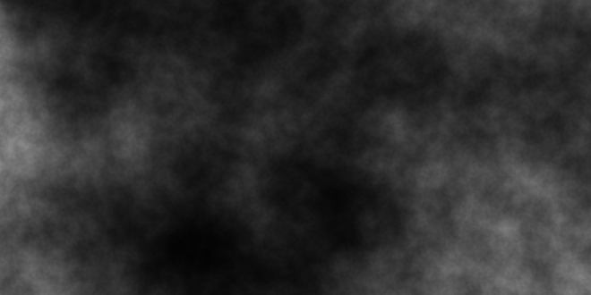

% Noiselib examples
% Flaviu Tamas
% -

## Source code
The source code can be found at <https://github.com/flaviut/noiselib>.

## White noise (seed `1`)

`noiselib -h 330 -w 660 -a WhiteNoiseNearest --scale 20 -s 1 --out nn_s20_1.png`

## White noise (seed `2`)

`noiselib -h 330 -w 660 -a WhiteNoiseNearest --scale 20 -s 2 --out nn_s20_2.png`

## White noise with linear interpolation

`noiselib -h 330 -w 660 -a WhiteNoiseLinear --scale 20 -s 1 --out lin_s20_1.png`

## Simplex noise

`noiselib -h 330 -w 660 -a Simplex --scale 20 -s 1 --out sim_s20_1.png`

## Zoomed in simplex noise

`noiselib -h 330 -w 660 -a Simplex --scale 400 -s 1 --out sim_s400_1.png`

## Simplex noise with [FBM](https://en.wikipedia.org/wiki/Fractional_Brownian_motion)

`noiselib -h 330 -w 660 -a Simplex --scale 20 -s 1 --fbm --out sim_s20_fbm_1.png`

## Zoomed in simplex with FBM

`noiselib -h 330 -w 660 -a Simplex --scale 400 -s 1 --fbm --out sim_s400_fbm_1.png`

## White noise with FBM

`noiselib -h 330 -w 660 -a WhiteNoiseNearest --scale 5 -s 1 --fbm --out nn_s5_fbm_1.png`

